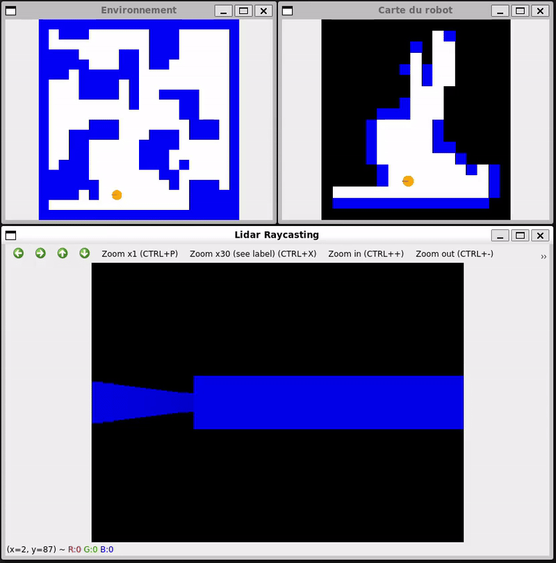

# Simulation de Navigation Robotique avec LiDAR

Ce projet implémente une simulation robotique utilisant un **robot mobile équipé d'un LiDAR** pour explorer un environnement inconnu. Il utilise OpenCV pour visualiser l'environnement et la carte du robot en temps réel.

## Membres du groupe
- FERRIER Simon
- LAMOULLER Clément
- PARIZOT Luan

## Objectif du projet
Le but est de simuler un robot mobile explorant un environnement inconnu en utilisant un LiDAR pour construire une carte. Le robot doit éviter les obstacles, explorer toutes les zones accessibles et naviguer efficacement.

## Diagramme UML du projet
<p align="center">
  
</p>

## Fonctionnalités
- **Environnement généré aléatoirement** avec des obstacles de tailles variées.
- **Robot initialisé aléatoirement** sans conaissance de sa position.
- **Algorithme de [raycasting](https://lodev.org/cgtutor/raycasting.html)** pour les mesures LiDAR.
- **Exploration autonome** avec mise à jour de la carte à partir des données du LiDAR.
    - Algorithme [A*](https://en.wikipedia.org/wiki/A*_search_algorithm) pour la recherche de chemin.
- **Visualisation en temps réel** :
  - Vue 2D de l'environnement et de la carte du robot.
  - Vue 3D simplifiée utilisant le raycasting pour simuler la perception du robot.

## Dépendances
- **[OpenCV](https://opencv.org/)** : Pour les affichages graphiques.
- **CMake** : Pour la configuration et la construction du projet.
- **C++11** ou version ultérieure.

## Installation et Compilation
**Cloner le dépôt** :
   ```bash
   git clone https://github.com/Cyclemnt/simulidar.git
  ```
**Compiler** :
   ```bash
   cd simulidar
   mkdir build
   cd build
   cmake ..
   make
   ./main
  ```

## Utilisation
1. Une fois le programme lancé, la simulation démarre en plaçant le robot aléatoirement dans un environnement.  
   Appuyez sur n'importe quelle touche pour commencer.
2. La simulation met à jour en temps réel l'état de l'environnement et la carte du robot.
3. Une fois que toutes les zones accessibles ont été explorées, la simulation s'arrête.  
   Appuyez sur n'importe quelle touche pour fermer les fenêtres.

## Personalisation
Modifiez les paramètres dans types.hpp pour personnaliser la simulation :

- **ENV_WIDTH**, **ENV_HEIGHT** : Dimensions de l’environnement.
- **OBSTACLE_NUM**, **OBSTACLE_MAX_SIZE** : Nombre et taille des obstacles.
- **TIMESTEP** : Pas de temps entre les mises à jour.
- **LIDAR_MAX_RANGE**, **LIDAR_RAY_COUNT** : Portée et précision du Lidar.
- **SPEED**, **ANG_V** : Vitesse du robot.

## Exemple visuel
<p align="center">
  
</p>


---

# Démarche de réflexion

## Problème à résoudre
L'objectif de ce projet est de simuler un robot autonome capable d'explorer son environnement et de reconstruire une carte en temps réel. Le robot, équipé d'un capteur de distance de type Lidar et d'un système de localisation idéal, doit détecter et cartographier les obstacles présents dans l’environnement.

## Démarche adoptée

### Étape 1 : Analyse des besoins
Pour atteindre ces objectifs, nous avons identifié les éléments nécessaires :  
1. Un modèle d'environnement contenant des obstacles de tailles et positions aléatoires.  
2. Un capteur Lidar simulé capable de détecter les obstacles tout autour du robot.  
3. Un mécanisme de mise à jour de la carte, permettant au robot de marquer les zones explorées et non explorées.  
4. Un algorithme de navigation robuste pour planifier les déplacements du robot.  
5. Un moyen de visualisation en temps réel.  

### Étape 2 : Modélisation du problème
L'environnement est représenté comme une grille d'occupation 2D, où chaque cellule correspond à une portion de l'espace. Les obstacles sont définis comme des zones bloquées dans cette grille. Le robot utilise un Lidar simulé pour mesurer une distance jusqu'à un éventuel obstacle. Les déplacements sont modélisés comme des transitions d'un point (x, y) à un autre sur la grille. La navigation utilise une version simplifiée de l’algorithme A* pour trouver le chemin optimal.

---

## Explication de la solution

### Lidar simulé
Le Lidar simule un capteur de distance à 360 degrés qui permet au robot de détecter les obstacles dans son environnement en projetant des rayons (raycasting). Chaque rayon mesure la distance jusqu'à l'obstacle le plus proche dans sa direction, en utilisant un algorithme basé sur la méthode DDA (Digital Differential Analyzer).

#### Fonctionnement du Lidar

1. **Position initiale et orientation** :  
   - Le capteur récupère la position absolue du robot dans l'environnement (_rayStartX_, _rayStartY_) et son orientation actuelle (_orientation_).  
   - Chaque rayon est défini par un ID (_rayID_), ce qui détermine son angle relatif par rapport à l'orientation du robot.

2. **Calcul de l'angle du rayon** :  
   L'angle d'un rayon est calculé par la formule :  
   
   _rayAngle = orientation + (rayID - rayCount / 2) * (pi / 180)_
   
   Cela répartit les rayons uniformément autour du robot sur 360°.

3. **Définition de la direction** :  
   Le rayon est représenté comme un vecteur directeur (_rayDirX_, _rayDirY_), calculé à partir de la fonction trigonométrique :  
   
   _rayDirX = cos(rayAngle)_, _rayDirY = sin(rayAngle)_
   
4. **Pas de progression** :  
   Le rayon progresse à travers la grille de l'environnement en calculant les distances à la prochaine ligne verticale ou horizontale de la grille, en utilisant :  
   
   _rayUnitStepSizeX = sqrt(1 + (rayDirY / rayDirX)^2)_, _rayUnitStepSizeY = sqrt(1 + (rayDirX / rayDirY)^2)_
   
5. **Avancée du rayon avec DDA** :  
   - Le rayon avance dans la grille case par case, en alternant entre les lignes et colonnes selon les distances accumulées _rayLengthX_ et _rayLengthY_.  
   - Pour chaque nouvelle case traversée, le programme vérifie si elle contient un obstacle. 

6. **Détection d'obstacle ou dépassement de portée** :  
   Si une case contenant un obstacle est détectée, le Lidar retourne la distance accumulée. Si aucun obstacle n'est trouvé dans la portée maximale, la fonction retourne une valeur indiquant l'absence d'obstacle.
6. **Détection d'obstacle ou dépassement de portée** :  
   - Si une case contenant un obstacle `CellState::Wall` est détectée, le Lidar retourne la distance accumulée.  
   - Si aucun obstacle n'est trouvé dans la portée maximale du Lidar _30 m_, la fonction retourne _-1_.

### Cartographie

La mise à jour de la carte se fait à chaque balayage des rayons du LiDAR. Avec la fonction `castRayAndMarkObstacle`, chaque cellule traversée par le rayon est marquée comme libre, et la cellule à la distance mesurée est marquée comme un mur. Si le rayon dépasse les limites actuelles de la carte, celle-ci est étendue dynamiquement.

### Choix de la destination

Le robot choisit sa prochaine cible en cherchant la cellule inconnue la plus proche, adjacente à une cellule libre. La distance est calculée selon la distance de Manhattan, soit la somme des différences absolues des coordonnées x et y entre deux points. La cellule la plus proche devient la prochaine destination.

### Algorithme A*
L'algorithme A* trouve le chemin optimal entre un point de départ et un objectif en utilisant une combinaison de coût réel et d'une estimation du coût restant (heuristique). L'heuristique utilisée ici est la distance de Manhattan, qui est la somme des distances absolues en x et en y entre le point actuel et l'objectif.

#### Fonctionnement de A*

1. Initialisation
- **Carte** : La carte est une grille contenant des états (`CellState::Wall` pour les murs et des cellules libres pour les déplacements).
- **Coût _gScore_** : Coût réel pour atteindre une cellule depuis le point de départ.  
  Initialement, toutes les cellules ont un coût infini, sauf le point de départ _gScore(start) = 0_.
- **Coût fScore** : Somme du coût réel _gScore_ et d'une estimation heuristique _h(current, goal)_ pour atteindre l'objectif.  
  Pour le départ :  
  
  _fScore(start) = h(start, goal) = |start.x - goal.x| + |start.y - goal.y|_
  
  (Distance de Manhattan, adaptée pour les mouvements sur une grille orthogonale.)
- **File de priorité** : Les nœuds à explorer sont organisés dans une file de priorité (_openQueue_), triée selon _fScore_.

2. Recherche du chemin
L'algorithme suit un processus itératif :
1. **Sélection du meilleur nœud** :  
   Extraire de la file de priorité le nœud avec le coût _fScore_ le plus faible.
2. **Vérification de l'objectif** :  
   Si ce nœud est l'objectif, reconstruire le chemin en remontant les parents via _cameFrom_.
3. **Exploration des voisins** :  
   Pour chaque voisin orthogonal du nœud actuel :  
   - Ignorer les voisins hors limites ou occupant un mur.
   - Calculer un coût provisoire pour atteindre le voisin _gScore(current + 1)_.
   - Si le voisin est atteint avec un coût inférieur à un chemin précédent :  
     - Mettre à jour _gScore(neighbor)_ et _fScore(neighbor)_.
     - Ajouter le voisin à la file de priorité.

---

## Déplacement du robot

La fonction `Robot::executeInstruction()` est dédiée au déplacement incrémental du robot vers une position cible spécifiée. Elle décompose le mouvement en deux étapes : ajustement de l'orientation et déplacement en ligne droite.

- **Orientation** : La fonction calcule l'angle nécessaire pour que le robot pointe dans la direction de la cible. Si l'orientation actuelle diffère de l'orientation cible, le robot ajuste son angle de rotation en tenant compte de sa vitesse angulaire maximale.

- **Avancement** : Une fois correctement orienté, le robot avance vers la cible à une vitesse constante. La distance parcourue est limitée par le produit de la vitesse de déplacement maximale et du pas de temps (`timeStep`).

- **Condition d'accomplissement** : La fonction vérifie si le robot a atteint la position cible en comparant ses coordonnées actuelles avec celles de la cible. Si c'est le cas, elle retourne true. Sinon, elle continue d'ajuster orientation et position dans les appels suivants.

Cette méthode est appelée en boucle pour guider le robot pas à pas vers la cible, en s'assurant que chaque mouvement est précis et limité par les capacités physiques du robot.

---

## Orchestration des fonctions

La méthode `Simulation::run()` orchestre l'ensemble du processus d'exploration de l'environnement par le robot. Elle combine la collecte de données, la mise à jour de la carte, le calcul des trajets et l'exécution des mouvements dans une boucle principale.

- **Lecture des capteurs** : À chaque itération, la simulation commence par lire les données des capteurs LiDAR du robot pour détecter les obstacles autour de lui.

- **Mise à jour de la carte** : Ces données sont utilisées pour mettre à jour la carte interne de l'environnement, en ajoutant ou en modifiant les cellules pour refléter les zones découvertes ou occupées.

- **Calcul de la cible et du chemin** : La simulation identifie le point inexploré le plus proche en utilisant `findNearestInterestPoint()`. Elle utilise ensuite l’algorithme A* pour calculer le chemin optimal reliant la position actuelle du robot à ce point cible.

- **Déplacement du robot** : Si un chemin est trouvé, la simulation décompose le trajet en instructions unitaires que le robot exécute pas à pas avec `executeInstruction()`. Pendant ces déplacements, la carte est mise à jour visuellement pour refléter les progrès.

- **Condition de fin** : Si aucun point inexploré n'est accessible, l'exploration est considérée comme terminée, affiche un message, et met fin à l'exécution.

Cette fonction constitue le cœur de la simulation, en assurant une exploration systématique de l'environnement jusqu'à ce que toutes les zones soient découvertes ou qu'il soit impossible d'atteindre de nouvelles cibles.

## Résultats

### Visualisations
Les résultats incluent deux types de visualisations pour mieux comprendre le comportement du robot :  
1. **Vue 2D de l’environnement et de la carte du robot** :  
<p align="center">
  
</p>
   Cette vue montre la position du robot, les obstacles et sa carte de départ, qui est vide.  

2. **Vue 3D simulée (Raycasting)** :  
<p align="center">
  
</p>
   Cette vue simule la perception du robot en projetant les lectures du Lidar sur un plan 3D. 

### Performance
Le robot explore entièrement les zones accessibles dans des environnements complexes. Les performances dépendent de la densité des obstacles et de la portée du Lidar.

## Conclusion

Ce projet montre comment un robot autonome peut explorer un environnement inconnu en combinant planification de chemin, mise à jour de carte en temps réel et perception par capteur. Les résultats démontrent l'efficacité de cette approche dans des scénarios variés.